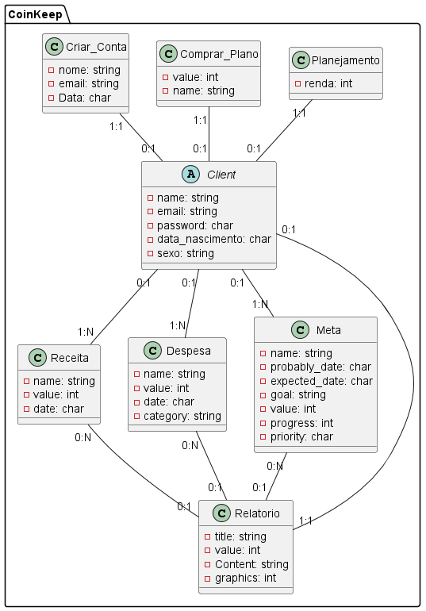

## Projeto-de-Eng.Soft2

   ### CoinKeep
   
  
### Participantes
  * Guilheme Sandroni Dias - RA = 0030482121040
  
### Tecnologias a Serem Utilzadas:

  * JavaScript
  * Html
  * Css
  * React
  * Bootstrap
  
  
  
### Resumo do projeto:
 * O projeto "CoinKeep" é um aplicativo móvel abrangente de gestão financeira com recursos poderosos e interface intuitiva. Ele ajuda os usuários a controlar suas finanças pessoais de maneira eficaz, permitindo a criação de orçamentos, organização de despesas e geração de relatórios  sobre atividades financeiras. O aplicativo também oferece recursos para monitorar metas financeiras, categorizar gastos.
* O aplicativo se destina a um público amplo, abrangendo pessoas de todas as idades que desejam melhorar sua administração financeira. Independentemente de você ser um estudante universitário que deseja controlar seus gastos mensais ou um profissional que busca otimizar seus investimentos, o CoinKeep oferece as ferramentas necessárias.

### Público alvo:
 * O CoinKeep é destinado a um público amplo e diversificado, incluindo:
 * Estudantes universitários em busca de controle financeiro.
 * Profissionais que desejam otimizar seus investimentos.

### Principais dores que o projeto resolve:
 * Falta de organização financeira.
 * Dificuldade em acompanhar gastos e despesas.
 * Incerteza sobre como investir dinheiro de forma eficaz.
  
### Formas de monetização
  * Planos de Software Pago: Os usuários podem acessar a aplicação sem a necessidade de visualizar publicidade.

  * Anúncios (Ads): O aplicativo exibirá anúncios relevantes para os usuários, gerando receita por meio de publicidade.

## Briefing Software Finanças

### Principais recursos e funcionalidades do CoinKeep:

* Criação de Orçamentos: Os usuários podem definir o orçamento para uso da aplicação.

* Organização de Despesas: Os usuários podem registrar suas despesas de forma rápida e fácil, categorizando-as automaticamente ou manualmente.

* Relatórios Detalhados: O CoinKeep gera relatórios claros e seguros com gráficos e análises para ajudar os usuários a visualizar seu progresso financeiro ao longo do tempo.

* Monitoramento de Metas Financeiras: Os usuários podem definir metas de economia e o aplicativo ajuda a rastrear o progresso em direção a essas metas.

### Observações:
* A automação para a entrada de dados do usuario será progredidamente atualizada.

### Requisitos da Versão Beta
#### Para a versão beta do CoinKeep, os seguintes requisitos técnicos e de funcionalidade são essenciais:
* Compatibilidade com dispositivos móveis que executam Android 11 ou superior e sistemas iOS.
* Registro de conta de usuário e autenticação.
* Capacidade de criar e gerenciar orçamentos, despesas e metas financeiras.
* Geração de relatórios básicos sobre atividades financeiras.
  
### Perfis
* Usuario: Pode criar uma conta no aplicativo, usar todas as funcionalidades  para gerenciar suas finanças e os acessar recursos.
*  Admin: Tera acesso total ao software garantindo estabilidade, performance e segurança para a aplicação.

### Responsividade
* Ter o layout correto para larguras de tela com 320px ou mais.
* Não considerar larguras menores que 320px.

## Diagramas:

### Casos de Uso:

### Modelo Conceitual:

### End Points:

### Wireframe:

